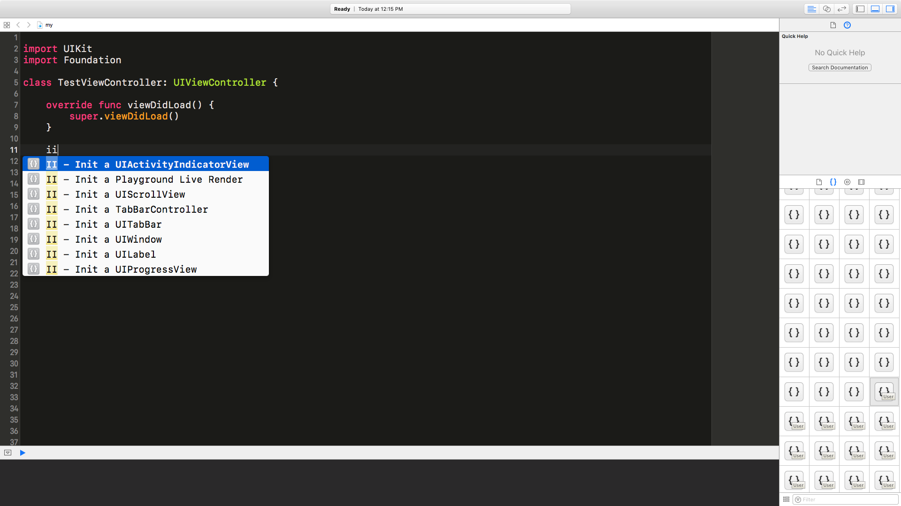

# XcodeSyncTools
===============================

A English version of this document can be found [here](https://github.com/5SMNOONMS5/XcodeSyncTools/blob/master/README.md)

小弟 xcode 個人的 **程式碼片段** 還有 **程式碼樣板** 同步小工具.

## 什麼是 程式碼片段 跟 程式碼樣板？

### 程式碼片段


* 輸入自定義關鍵字，然後你的片段就會跳出來，幫您開發節省時間。

### 程式碼樣板


* 類似程式碼片段的概念，但是可以省下建立檔案還有 xib 的時間。

## 此專案是幹嘛的？

* 同步多台電腦的 程式碼片段 還有 程式碼樣板 檔案。

## 此專案原理


* 看圖其實很好懂，比較想說的是 [fsevents-tools](https://github.com/ggreer/fsevents-tools) 。 fsevents-tools 利用 OS X's [FSEvents](https://en.wikipedia.org/wiki/FSEvents) API 來監聽檔案或者目錄的變化，
只要發生任何變化 (新增，刪除，修改) 就會跟著執行 rsync 腳本去把 xcode 目錄底下的 程式碼樣板 還有 程式碼片段 同步到這個專用底下的資料夾，這樣每當在 xcode 裡面修正樣板程式碼的時候，XcodeSyncTools 專案底下的檔案也會隨著一起變動。

## 快速開始

* 把專案 clone 下來。
* 執行腳本，然後會把會將 code_snippets 跟 custom_files 資料夾底下的檔案複製一份到 xcode 底下。

```bash
# 第 1 步: 先 clone 
git clone git@github.com:5SMNOONMS5/XcodeSyncTools.git

# 第 2 步: 移動工作目錄到 XcodeSyncTools 底下
cd XcodeSyncTools

# 第 3 步: 同步所有檔案
sh xcode-sync.sh -s
```

## 更多選項請打 -h 

```bash
sh xcode-sync.sh -h
``` 

## 程式碼片段 使用關鍵字

### II

Type **II** for initialization



### DD

Type **DD** for Delegate And Datasource


### FF

Type **FF** for FIXME


### MM

Type **MM** for Mark


### VV

Type **VV** for View Life Cycle


## 程式碼樣板 使用方式

----- 待續 -----
